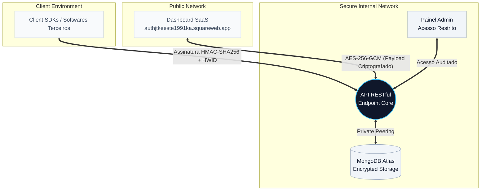

# SecAuth (Projeto Sentinela)
**Enterprise Security-as-a-Service Infrastructure**

*Plataforma B2B que fornece um ecossistema completo de criptografia, licenciamento e autenticação para softwares operando sob alto risco de engenharia reversa e pirataria.*

**Acesso ao Ambiente MVP:** [authjtkeeste1991ka.squareweb.app](https://authjtkeeste1991ka.squareweb.app)

---

## Engenharia e Arquitetura (Desenvolvimento Solo)

A arquitetura de proteção de todo o ecossistema foi desenhada e executada 100% por mim, estruturada rigorosamente para atender às exigências de segurança de alto nível do cliente. A condução do projeto abrangeu a engenharia unificada de ponta a ponta:

* **Software Engineering (Full-Stack):** Desenvolvimento integral da API RESTful, construção das interfaces web (SaaS e Admin) e integração de módulos SDK (C++, Python, Node.js) para comunicação segura com os softwares finais.
* **Cyber Security & Pentesting:** Modelagem de ameaças e blindagem ativa. Execução de testes de intrusão, proteção contra ataques Man-in-the-Middle (MitM), higienização de injeções de banco de dados e mitigação de Brute-force.
* **DevOps & Infraestrutura:** Orquestração de rotas, deploy de alta disponibilidade e configuração otimizada de banco de dados em nuvem sob regras de particionamento e Whitelisting.

---

## Topologia de Rede e Particionamento Isolado

Para garantir a máxima integridade e anular riscos de comprometimento cruzado, o sistema utiliza um método de particionamento estrito. Os módulos operam em ambientes fisicamente isolados, comunicando-se unicamente através de conexões encriptadas:

1. **Core API (Back-End):** Motor de validação criptográfica, responsável por transações de base de dados, segurança de requisições e processamento financeiro.
2. **Dashboard SaaS (Front-End):** Plataforma web voltada para clientes corporativos efetuarem a gestão de aplicações, licenças e métricas de uso.
3. **Painel Admin:** Ambiente restrito e invisível à rede pública, focado na auditoria global, logs de tráfego e acionamento de bloqueios emergenciais.
4. **Client SDKs:** Módulos enxutos integrados no software de terceiros, operando com latência otimizada para validação de licenças e biometria de hardware.

---

## Escopo de Proteção e Primitivas Criptográficas

A plataforma afasta-se de mecanismos de validação vulneráveis em aplicações nativas, adotando um padrão de defesa de nível militar focado na integridade do pacote:

* **Muralha AES-256-GCM:** O tráfego bidirecional entre o Painel Web e a API trafega com o payload inteiramente ofuscado de ponta a ponta.
* **Assinaturas HMAC-SHA256:** Aplicações clientes (SDKs) não transmitem chaves de API expostas na rede. A autenticidade é atestada assinando matematicamente o pacote, preservando a Secret Key.
* **Hardware ID Lock (HWID):** O sistema realiza a leitura física do hardware (MAC Address, CPU). A licença é permanentemente fixada à máquina do usuário final, anulando o compartilhamento ilícito.
* **Anti-Replay Attack e Timestamping:** Incorporação de Nonces criptográficos únicos aliados à tolerância de tempo restrita (milissegundos) para invalidar pacotes interceptados e clonados.
* **Anti-Flood e Rate Limiting:** Middlewares de bloqueio na borda da aplicação para neutralizar ataques DDoS direcionados e automatizações maliciosas.

---

## Stack Tecnológica

A infraestrutura foi consolidada com tecnologias corporativas para suportar concorrência I/O e assegurar tipagem estrita de dados:

**Front-End (Web SaaS & Admin):**
 

**Back-End (Core API & SDKs):**
 

**Database (Persistência e Segurança):**
 

---

## Interface de Operações e Módulos do Sistema

Abaixo encontra-se a galeria detalhada das interfaces desenvolvidas, cobrindo o painel comercial, gestão interna de licenciamento e módulos financeiros.

<table align="center" style="border: none; text-align: center;">
<tr>
<td width="50%">
<b>Apresentação B2B (Landing Page Hero)</b>  

</td>
<td width="50%">
<b>Apresentação B2B (Recursos e Defesa)</b>  

</td>
</tr>
<tr>
<td width="50%">
<b>Dashboard Geral do Cliente (SaaS)</b>  

</td>
<td width="50%">
<b>Configurações da Aplicação (AppID e Secret)</b>  

</td>
</tr>
<tr>
<td width="50%">
<b>Gestão Interna (Controle de Licenças e Usuários)</b>  

</td>
<td width="50%">
<b>Integração Direta e Monitoramento (API)</b>  

</td>
</tr>
<tr>
<td width="100%" colspan="2">
<b>Módulo Financeiro e Checkout de Assinaturas</b>  

</td>
</tr>
</table>
